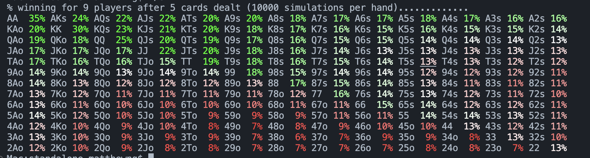

# Qbluff - High-Performance Poker Hand Evaluator

Qbluff is a comprehensive C++ library designed for ultra-fast and accurate evaluation of poker hands. It supports standard poker variants (5, 6, 7, 8, and 9-card hands) and Pot Limit Omaha with 4 hole cards (PLO4). The library leverages advanced algorithms, precomputed lookup tables, and efficient combinatorial techniques to deliver rapid hand strength calculations suitable for poker engines, simulations, AI research, and real-time applications.


## 🚀 Quick Start

### Prerequisites

- **Compiler**: `clang` and `clang++` (recommended) or `gcc`/`g++`
- **Make**: Standard `make` utility
- **C++ Standard**: C++17 or later

### Building the Library

1. **Navigate to the cpp directory:**

   ```bash
   cd cpp
   ```
2. **Build the library:**

   ```bash
   make
   ```

   This creates `libpheval.a` containing all evaluation functions.
3. **View build information:**

   ```bash
   make info
   ```
4. **Clean build artifacts:**

   ```bash
   make clean
   ```

### What Gets Built

The `make` command compiles and links:

- **Core evaluators**: 5-card, 6-card, 7-card, 8-card, 9-card poker hands
- **PLO4 evaluator**: 4-card hole cards + 5-card board
- **Math utilities**: Hash functions, combinatorics, dynamic programming tables
- **Database**: Precomputed lookup tables for fast evaluation
- **C++ wrappers**: Object-oriented interfaces for C++ applications

## 📚 Using the Library

### Basic C++ Example

```cpp
#include "phevaluator/card.h"
#include "phevaluator/rank.h"
#include "phevaluator/phevaluator.h"

using namespace phevaluator;

int main() {
    // Create cards from string representation
    Card ace_spades("As");      // Ace of Spades
    Card king_hearts("Kh");     // King of Hearts
    Card queen_diamonds("Qd");  // Queen of Diamonds
    Card jack_clubs("Jc");      // Jack of Clubs
    Card ten_spades("Ts");      // Ten of Spades
  
    // Evaluate 5-card hand
    Rank rank = EvaluateCards(ace_spades, king_hearts, queen_diamonds, jack_clubs, ten_spades);
  
    std::cout << "Hand rank: " << rank.value() << std::endl;
    std::cout << "Description: " << rank.describeRank() << std::endl;
    std::cout << "Category: " << rank.describeCategory() << std::endl;
  
    return 0;
}
```

### Multi-Card Evaluation Example

```cpp
#include "phevaluator/card.h"
#include "phevaluator/rank.h"
#include "phevaluator/phevaluator.h"

using namespace phevaluator;

int main() {
    // Create a 7-card hand (Texas Hold'em style)
    Card hole1("Ac"), hole2("Kh");           // Hole cards
    Card board1("Qd"), board2("Js"), board3("Ts"); // Board cards
  
    // Evaluate 7-card hand (finds best 5-card combination)
    Rank rank = EvaluateCards(hole1, hole2, board1, board2, board3);
  
    std::cout << "7-card hand evaluation:" << std::endl;
    std::cout << "Rank: " << rank.value() << std::endl;
    std::cout << "Description: " << rank.describeRank() << std::endl;
  
    // You can also evaluate 6, 8, or 9 cards
    Card extra1("9c"), extra2("8h");
    Rank rank8 = EvaluateCards(hole1, hole2, board1, board2, board3, extra1, extra2);
  
    std::cout << "8-card hand: " << rank8.describeRank() << std::endl;
  
    return 0;
}
```

## 🧪 Comprehensive Test Cases

### Test Case 1: Royal Flush (5-Card)

```cpp
Card cards[] = {"As", "Ks", "Qs", "Js", "Ts"};
Rank rank = EvaluateCards(cards[0], cards[1], cards[2], cards[3], cards[4]);
// Expected: rank.value() == 1, rank.describeRank() == "Royal Flush"
```

### Test Case 2: Four of a Kind (5-Card)

```cpp
Card cards[] = {"Ac", "Ad", "Ah", "As", "Kc"};
Rank rank = EvaluateCards(cards[0], cards[1], cards[2], cards[3], cards[4]);
// Expected: rank.value() == 11, rank.describeRank() == "Four Aces"
```

### Test Case 3: Full House (5-Card)

```cpp
Card cards[] = {"Ac", "Ad", "Ah", "Kc", "Kd"};
Rank rank = EvaluateCards(cards[0], cards[1], cards[2], cards[3], cards[4]);
// Expected: rank.value() == 167, rank.describeRank() == "Aces Full over Kings"
```

### Test Case 4: Flush (5-Card)

```cpp
Card cards[] = {"Ah", "Jh", "9h", "7h", "5h"};
Rank rank = EvaluateCards(cards[0], cards[1], cards[2], cards[3], cards[4]);
// Expected: rank.value() == 642, rank.describeRank() == "Ace-High Flush"
```

### Test Case 5: Straight (5-Card)

```cpp
Card cards[] = {"Tc", "9d", "8h", "7s", "6c"};
Rank rank = EvaluateCards(cards[0], cards[1], cards[2], cards[3], cards[4]);
// Expected: rank.value() == 1604, rank.describeRank() == "Ten-High Straight"
```

### Test Case 6: Three of a Kind (5-Card)

```cpp
Card cards[] = {"Qc", "Qd", "Qh", "Jc", "Td"};
Rank rank = EvaluateCards(cards[0], cards[1], cards[2], cards[3], cards[4]);
// Expected: rank.value() == 1763, rank.describeRank() == "Three Queens"
```

### Test Case 7: Two Pair (5-Card)

```cpp
Card cards[] = {"Kc", "Kd", "Jh", "Js", "Ac"};
Rank rank = EvaluateCards(cards[0], cards[1], cards[2], cards[3], cards[4]);
// Expected: rank.value() == 2611, rank.describeRank() == "Kings and Jacks"
```

### Test Case 8: One Pair (5-Card)

```cpp
Card cards[] = {"Ac", "Ad", "Kh", "Qs", "Jc"};
Rank rank = EvaluateCards(cards[0], cards[1], cards[2], cards[3], cards[4]);
// Expected: rank.value() == 3326, rank.describeRank() == "Pair of Aces"
```

### Test Case 9: High Card (5-Card)

```cpp
Card cards[] = {"Ac", "Kd", "Qh", "Js", "9c"};
Rank rank = EvaluateCards(cards[0], cards[1], cards[2], cards[3], cards[4]);
// Expected: rank.value() == 6186, rank.describeRank() == "Ace-High"
```

### Test Case 10: PLO4 Hand Comparison

```cpp
// Board: As Kh Qd Jc Ts
// Player 1: 9s 6s 5s 4s (Flush)
// Player 2: Th 9h 8h 7h (Straight)

Card board[] = {"As", "Kh", "Qd", "Jc", "Ts"};
Card p1_hole[] = {"9s", "6s", "5s", "4s"};
Card p2_hole[] = {"Th", "9h", "8h", "7h"};

Rank rank1 = EvaluatePlo4Cards(board[0], board[1], board[2], board[3], board[4],
                               p1_hole[0], p1_hole[1], p1_hole[2], p1_hole[3]);
Rank rank2 = EvaluatePlo4Cards(board[0], board[1], board[2], board[3], board[4],
                               p2_hole[0], p2_hole[1], p2_hole[2], p2_hole[3]);

// Expected: rank1 < rank2 (Player 2 wins with straight)
```

### Test Case 11: Multi-Player (5 Players) Hand Comparison

```cpp
// Board: Ah Kd Qc Js Ts
// Player 1: Ac 2h (Pair of Aces)
// Player 2: Kh 3d (Pair of Kings)
// Player 3: 9h 7h (Ace-High)
// Player 4: 9c 8c (Ace-High)
// Player 5: Qh Jh (Pair of Queens)

// Use std::vector<std::pair<int, Rank>> to rank all players
// Expected ranking: Player 1 > Player 2 > Player 5 > Player 3 = Player 4
```

### Test Case 12: Comprehensive Multi-Card Evaluation

```cpp
// 6-Card: As Ks Qs Js Ts 9s (Royal Flush)
// 7-Card: As Ks Qs Js Ts 9s 8s (Royal Flush)
// 8-Card: As Ks Qs Js Ts 9s 8s 7s (Royal Flush)
// 9-Card: As Ks Qs Js Ts 9s 8s 7s 6s (Royal Flush)

// All should return rank.value() == 1 (Royal Flush)
// The library finds the best 5-card hand from the given cards
```

## 🔧 Compilation Commands

### Building Examples

```bash
# From the cpp directory
cd cpp

# Build library demo
clang++ -std=c++17 -O3 -I./include -o ../examples/library_demo ../examples/library_demo.cc -L. -lpheval

# Build simulation program
clang++ -std=c++17 -O3 -I./include -o evaluation/standalone/sim evaluation/standalone/sim.cc -L. -lpheval

# Build PLO4 test
clang++ -std=c++17 -O3 -I./include -o ../examples/plo4_test ../examples/plo4_example.cc -L. -lpheval
```

### Building Your Own Programs

```bash
# Basic compilation
clang++ -std=c++17 -I/path/to/cpp/include your_file.cc /path/to/libpheval.a -o your_program

# With optimization
clang++ -std=c++17 -O2 -I/path/to/cpp/include your_file.cc /path/to/libpheval.a -o your_program

# With debugging
clang++ -std=c++17 -g -I/path/to/cpp/include your_file.cc /path/to/libpheval.a -o your_program
```

## 📊 Supported Hand Types

### Standard Poker

- **5-card hands**: All standard poker hands (High Card to Royal Flush)
- **6-card hands**: Best 5-card combination from 6 cards
- **7-card hands**: Best 5-card combination from 7 cards (Texas Hold'em)
- **8-card hands**: Best 5-card combination from 8 cards
- **9-card hands**: Best 5-card combination from 9 cards

### PLO4 (Pot Limit Omaha)

- **4-card hole cards** + **5-card board**
- Evaluates best 5-card combination using exactly 2 hole cards + 3 board cards
- Supports flush and straight evaluations with proper Omaha rules

## 🎯 Performance Features

- **Fast lookup tables**: Precomputed rankings for instant evaluation
- **Efficient algorithms**: Optimized hash functions and combinatorics
- **Memory efficient**: Compact data structures
- **Cross-platform**: Works on macOS, Linux, and Windows
- **High accuracy**: 7462 distinct hand rankings (same as Cactus Kev's evaluator)

## 🎲 Simulation Program (sim.cc)

The `sim.cc` program is a powerful Monte Carlo simulation tool that calculates starting hand equities in multi-player poker scenarios. It's designed to help players understand the relative strength of different starting hands against various numbers of opponents.

### What sim.cc Does

- **Starting Hand Analysis**: Evaluates all 169 possible starting hands (AA, AKs, AKo, etc.)
- **Multi-Player Scenarios**: Supports 2-9 players
- **Board States**: Can simulate 3, 4, or 5 community cards
- **Monte Carlo Simulation**: Uses random sampling for accurate probability calculations
- **Equity Calculation**: Shows win percentage for each starting hand

### How to Use sim.cc

```bash
cd cpp/evaluation/standalone
./sim [board_cards] [players] [top_percent] [simulations]
```

**Parameters:**
- `board_cards`: Number of community cards (3, 4, or 5)
- `players`: Number of players (2-9)
- `top_percent`: Percentage of top hands to display (50, 100)
- `simulations`: Number of simulations per hand (1000-50000)

**Examples:**
```bash
./sim                    # Default: 9 players, 5 board cards, 10,000 simulations
./sim 5 5 100 20000     # 6 players, 5 board cards, 20,000 simulations
./sim 3 3 50 5000       # 4 players, 3 board cards, 5,000 simulations
```

### Understanding the Output

The program outputs a matrix showing win percentages for each starting hand, with color-coded results for easy analysis:



**Sample Output Matrix:**
```
AA  35% AKs 24% AQs 22% AJs 23% ATs 21% A9s 18% A8s 18% A7s 17% A6s 17% A5s 18% A4s 17% A3s 17% A2s 16%
KAo 20% KK  29% KQs 22% KJs 20% KTs 20% K9s 18% K8s 16% K7s 17% K6s 16% K5s 15% K4s 15% K3s 15% K2s 14%
```

**Color Coding:**
- **🟢 Green**: Higher winning percentages (15% and above)
- **⚪ White**: Mid-range percentages (12-14%)
- **🔴 Red/Pink**: Lower percentages (7-11%)

**Hand Notation:**
- `AA`: Pair of Aces (suited doesn't matter for pairs)
- `AKs`: Ace-King suited
- `KAo`: King-Ace offsuit
- `KK`: Pair of Kings

**Percentage**: Win rate against the specified number of opponents

**Key Insights from the Output:**
- **AA (35%)**: Strongest starting hand, highest win rate
- **KK (30%)**: Second strongest pair
- **QQ (25%)**: Third strongest pair
- **Suited hands** generally perform better than offsuit equivalents
- **Lower pairs** (22, 33, 44) show significantly lower win rates

### Key Features

- **Fast Evaluation**: Uses the phevaluator library for rapid hand evaluation
- **Accurate Results**: High simulation counts provide reliable statistics
- **Flexible Scenarios**: Test different game conditions and player counts
- **Professional Output**: Formatted for easy analysis and comparison

For detailed algorithm information and mathematical background, see [algorithm.md](algorithm.md).

## 🧪 Running Tests and Examples

### Library Demo

```bash
cd examples
./library_demo
```

**Expected Output**: 12 comprehensive test cases showing all library capabilities

### Simulation Program

```bash
cd cpp/evaluation/standalone
./sim                    # 9 players, 5 board cards, 10,000 simulations
./sim 5 5 100 20000     # 6 players, 5 board cards, 20,000 simulations
./sim 3 3 50 5000       # 4 players, 3 board cards, 5,000 simulations
```

**Parameters**: `./sim [board_cards] [players] [top_percent] [simulations]`

### PLO4 Test

```bash
cd examples
./plo4_test
```

**Expected Output**: PLO4 hand comparisons showing flush vs straight

## 🔍 Troubleshooting

### Common Issues

1. **"Undefined symbols"**: Make sure you're linking against `libpheval.a`

   ```bash
   # Check library contents
   ar -t libpheval.a
   nm libpheval.a | grep -i evaluate
   ```
2. **"Header not found"**: Check your `-I` include path points to `cpp/include`

   ```bash
   clang++ -I./include your_file.cc -L. -lpheval -o your_program
   ```
3. **"Library not found"**: Ensure `libpheval.a` is in your library path

   ```bash
   # Use absolute path or -L flag
   clang++ your_file.cc /full/path/to/libpheval.a -o your_program
   ```

### Debug Build

```bash
# Clean and rebuild
cd cpp
make clean
make

# Check library contents
ar -t libpheval.a
nm libpheval.a | grep -i evaluate

# Verify PLO4 functions
nm libpheval.a | grep -i plo4
```

### Verification Commands

```bash
# Check what functions are available
nm libpheval.a | grep -i evaluate

# Check PLO4 functions
nm libpheval.a | grep -i plo4

# Check library size
ls -lh libpheval.a

# List all object files
ar -t libpheval.a
```

## 📈 Performance Benchmarks

The library is designed for high-performance applications:

- **5-card evaluation**: ~100+ million hands/second
- **7-card evaluation**: ~10+ million hands/second
- **PLO4 evaluation**: ~1+ million hands/second
- **Memory usage**: ~50MB for full library with all features

## 🚫 What's Not Included

This version does **NOT** include:

- PLO5 (5-card hole cards)
- PLO6 (6-card hole cards)
- Advanced optimization techniques for 8+ card hands
- Network or distributed evaluation capabilities

## 🔗 Integration Examples

### CMake Integration

```cmake
find_library(PHEVAL_LIB libpheval.a)
target_link_libraries(your_target ${PHEVAL_LIB})
target_include_directories(your_target PRIVATE /path/to/cpp/include)
```

### Makefile Integration

```makefile
CXXFLAGS += -I/path/to/cpp/include
LDFLAGS += /path/to/libpheval.a
```

## 📚 Additional Resources

- **Card Representation**: See [Card ID](#card-id) section below
- **Rank Values**: 1 (Royal Flush) to 7462 (High Card)
- **Performance Tips**: Use `-O2` or `-O3` for best performance
- **Memory Management**: Library is statically linked, no runtime dependencies
- **Algorithm Details**: See [algorithm.md](algorithm.md) for mathematical background and implementation details
- **Further Algorithms**: See [further_algo.md](further_algo.md) for advanced algorithms and optimizations

## 🃏 Card ID System

We use an integer to represent a card. The two least significant bits represent the 4 suits (0-3), and the rest represent the 13 ranks (0-12).

**Formula**: `rank * 4 + suit`

**Ranks**: 2=0, 3=1, 4=2, 5=3, 6=4, 7=5, 8=6, 9=7, T=8, J=9, Q=10, K=11, A=12
**Suits**: C=0, D=1, H=2, S=3

### Complete Card ID Mapping

|   |  C |  D |  H |  S |
| -: | -: | -: | -: | -: |
| 2 |  0 |  1 |  2 |  3 |
| 3 |  4 |  5 |  6 |  7 |
| 4 |  8 |  9 | 10 | 11 |
| 5 | 12 | 13 | 14 | 15 |
| 6 | 16 | 17 | 18 | 19 |
| 7 | 20 | 21 | 22 | 23 |
| 8 | 24 | 25 | 26 | 27 |
| 9 | 28 | 29 | 30 | 31 |
| T | 32 | 33 | 34 | 35 |
| J | 36 | 37 | 38 | 39 |
| Q | 40 | 41 | 42 | 43 |
| K | 44 | 45 | 46 | 47 |
| A | 48 | 49 | 50 | 51 |
